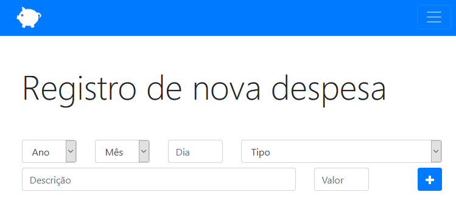

# Orçamento Pessoal

> Um app JavaScript simples de orçamento pessoal.

*Leia em outros idiomas:* [English](https://github.com/filimor/personal-budget/blob/master/README.md), [Português (Brasil)](https://github.com/filimor/personal-budget/blob/master/README.pt-br.md)

## Descrição

Um app bem básico de orçamento pessoal usando somente o Local Storage do navegador. Foi feito no curso da Udemy ['Desenvolvimento Web Completo 2020 - 20 cursos + 20 projetos'](https://www.udemy.com/course/web-completo/) (por Jailton Damasceno e Jorge Sant'Ana).

 

## Como usar

Basta clonar ou fazer o download do projeto e rodá-lo em seu navegadpr.

## Feito com

## Traduções

* [English](https://github.com/filimor/personal-budget/blob/master/README.md)
* [Português (Brasil)](https://github.com/filimor/personal-budget/blob/master/README.pt-br.md)

## Créditos

- [Jorge Sant'Ana](https://www.jorgesantana.net.br)
- [@filimor](https://github.com/filimor/)

## Contato

- E-mail: filimor@posteo.net
- LinkedIn: https://www.linkedin.com/in/filimor/
- Twitter: https://www.twitter.com/filimorbr/

## Licença

This project is licensed under the MIT License - see the [LICENSE.md](https://github.com/filimor/personal-budget/blob/master/LICENSE "MIT") file for details.
